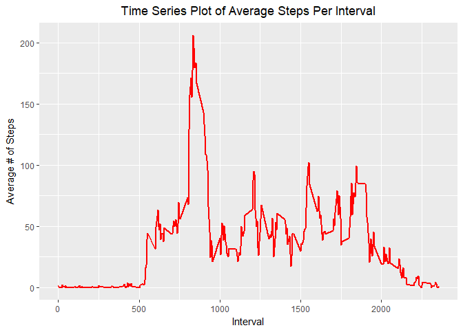
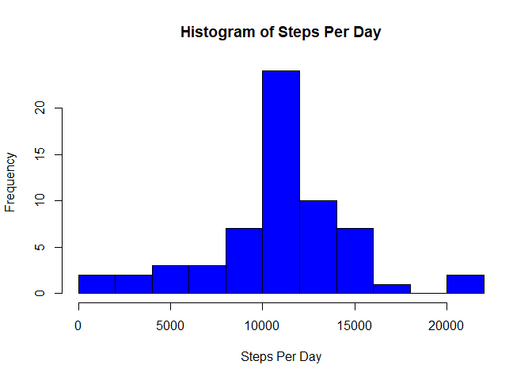
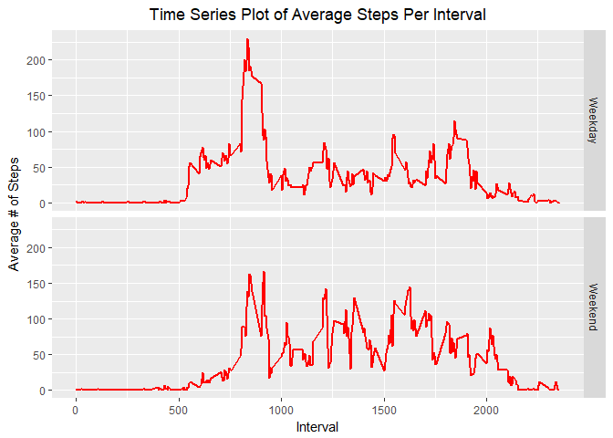

# Reproducible Research: Peer Assessment 1


## Overview
This project is concerned with looking at daily activity patterns of a number of anonymous subjects over the course of two months. The data was taken using personal activity monitoring devices. These devices take readings at 5 minute intervals each day. The data we are working with were taken over a two month period duting October and November of 2012. We will investigate daily total steps, average steps per interval, and the effect of imputing data that is not availble. Finally, we will look at activity patterns on weekdays and weekends and determine if there is a difference. NOte that we are using the libraries dplyr, data.table, and ggplot2 for this analysis.

## Loading and preprocessing the data
We first check to see if the data file we want (activity.csv) is in the working directory. If not, we download and unzip the .zip file from the Coursera website. The data is read into a data frame and we convert the date column to a POSIX date object so we can use the weekdays() function later on.


```r
## Check to see if file exists in working directory, if not, download and unzip
zipfileURL <- "https://d396qusza40orc.cloudfront.net/repdata%2Fdata%2Factivity.zip"
zipdest <- "activity.zip"
activityfile <- "activity.csv"

if (!file.exists(activityfile)) {
  download.file(zipfileURL, zipdest, method="auto")
  unzip(zipdest)
}

# Load the activity file into a dataframe
activity <- read.csv("activity.csv")

# Convert date from factor to Date
activity$date <- as.Date(as.character(activity$date), "%Y-%m-%d")
```

## What is mean total number of steps taken per day?

Our first task is to look at a histogram of the total number of steps taken per day, less any NA values that appear in the data. This is easily done leveraging dplyr to group by date and then summarize the data by summing up all of the steps in any given day. We then call the hist() function to display a histogram of the transformed data.

```r
stepsperday <- activity %>% group_by(date) %>%
                            summarize(daily_steps = sum(steps, na.rm = TRUE))
hist(stepsperday$daily_steps, breaks = 10, xlab = "Steps Per Day", ylab = "Frequency", col = "blue", main = ("Histogram of Steps Per Day"))
```

<!-- -->

From the first part, it's trivial to calculate the mean and median of the number of steps taken daily. That's shown below.

```r
mean_steps <- mean(stepsperday$daily_steps)
median_steps <- median(stepsperday$daily_steps)
mean_steps
```

```
## [1] 9354.23
```

```r
median_steps
```

```
## [1] 10395
```

## What is the average daily activity pattern?

The second part of this analysis is to look at the average daily activity pattern by looking at a time series graph of the average steps by interval. Again, we leverage dplyr to group by interval and summarize using the mean number of steps for each interval, again ignoring NAs. We then use ggplot to display the graph, showing the pattern of activity. Finally, we use which.max() to look up the interval with the largest mean number of steps and display it.


```r
steps_interval <- activity %>% group_by(interval) %>%
                               summarize(avg_step_interval = mean(steps, na.rm = TRUE))

ggplot(steps_interval, aes(interval, avg_step_interval)) + geom_line(size = 1, color = "red") + xlab("Interval") + ylab("Average # of Steps") + ggtitle("Time Series Plot of Average Steps Per Interval") + theme(plot.title = element_text(hjust = 0.5))
```

<!-- -->

```r
max_interval <- as.numeric(steps_interval[which.max(steps_interval$avg_step_interval), "interval"])
max_interval
```

```
## [1] 835
```

## Imputing missing values

The third section of this report deals with imputing our missing values so we can, hopefully, get a more accurate picture of daily activity patterns. In this case, I've chosen to leverage work I've already done above, i.e. finding the mean number of steps per interval. Using data.table, I join steps_interval with the original activity table by interval and then replace the NA values with the mean values calculated above, rounded. We then use dplyr to find the number of daily steps and produce another histogram, noting that it is closer to a normal distribution than the first historgram, which makes sense since we used the mean number of steps per interval to account for the missing data.


```r
activity <- data.table(activity, key = "interval")
steps_interval <- data.table(steps_interval, key = "interval")
imputed_activity <- activity[steps_interval]
imputed_activity$avg_step_interval <- as.integer(round(imputed_activity$avg_step_interval))
imputed_activity[is.na(steps), steps := avg_step_interval]

imputed_steps_per_day <- imputed_activity %>% group_by(date) %>%
                               summarize(daily_steps = sum(steps, na.rm = TRUE))

hist(imputed_steps_per_day$daily_steps, breaks = 10, xlab = "Steps Per Day", ylab = "Frequency", col = "blue", main = ("Histogram of Steps Per Day"))
```

<!-- -->


## Are there differences in activity patterns between weekdays and weekends?

Finally, we want to look at the differences between weekdays and weekends. In order to do this, I wrote a simple function that takes the name of the day (which is what the weekdays() function returns) and returns whether it is a Weekend day or a Weekday. Getting from date to Weekend/Weekday is a multi-step process. First, we convert our Dates into day names. I then use lapply to apply my weekend function to the day vector (unlist is necessary to convert the result of lapply, a list, to a vector). I then replace the corresponding column in imputed_steps_per_day with that result. Finally, we once again leverage dplyr to group by both interval and day and then summarize the mean number of steps per interval per Weekday or Weekend day.

The plot is once again handled by ggplot, utilizing the facet_grid to allow us to display comparison plots of mean activity by interval and by Weekend day and Weekday. We do see some differences, but they are partially obscured by how I imputed the data earlier. Since I used the mean of all days, the imputed data is a combination of both Weekend and Weekday activity, leaning heavier toward Weekday since there are more of them. This could be mitigated by first categorizing the data by Weekend day or Weekday and using the means of each to impute the respective missing data. There would still be some error introduced, since there will be less Weekend data to average than Weekday data.

```r
weekend <- function(day){
        if (day == 'Saturday' || day == "Sunday"){
          return("Weekend")
        } else { return("Weekday")}
}

imputed_steps_per_day <- imputed_activity %>% mutate(day = as.factor(weekdays(date)))

day <- imputed_steps_per_day$day
day <- unlist(lapply(day, weekend))
imputed_steps_per_day$day <- day

imputed_steps_per_day <- imputed_steps_per_day %>%
                            group_by(interval, day) %>%
                            summarize(avg_step_interval = mean(steps))

ggplot(imputed_steps_per_day, aes(interval, avg_step_interval)) + geom_line(size = 1, color = "red") + xlab("Interval") + ylab("Average # of Steps") + ggtitle("Time Series Plot of Average Steps Per Interval") + theme(plot.title = element_text(hjust = 0.5)) +facet_grid(day~.)
```

<!-- -->
